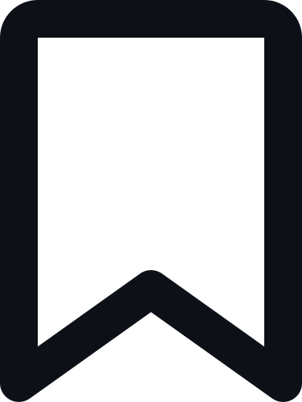

<!--  views/stars/followers -->
 

<a href="https://github.com/its-abdou">
   
</a>
<a href="https://api.github-star-counter.workers.dev/user/its-abdou">
   
</a>

 

**Who Am I?**

I’m a 20-year-old `Engineering and Management of Information Systems student` at the `National Polytechnic School of Oran` **(ENPO)**, passionate about building real-world projects that blend creativity and problem-solving.

My journey started with a curiosity for games and technology, and today I specialize in `fullstack development` — working with Express & Laravel on the backend and React & Next.js on the frontend.

I’m also exploring **AI, cloud, and mobile development**, aiming to become an engineer capable of designing scalable systems and ultimately creating products that make a meaningful impact.

 

<!-- Gif  -->
 

<!-- A Little More About Me -->
 <h3 align="center">
  
  A Little More About Me 
  
 </h3>

 ⬛ I enjoy collaborating , and learning from experienced peers 
 ⬜ Currently working on ML projects.   
 ⬛ Building skills in mobile development **(Kotlin, Flutter)** to launch my own apps.  
 ⬜ Interested in any large-scale project that makes me think. 
 ⬛ Outside tech, I’m into chess, and Video Games.
 ㅤ
  <!-- linkedin and more --> 
  
 
  
   
  

 

<!-- github status-->
<h3 align="center">

 GitHub Status 

</h3>
 

<!-- Status -->

<!-- My Tech Stack -->

<h3 align="center">
 
 My Tech Stack
 
</h3>

 

     
     
     
     
     

 

<!-- My Best Repositories -->

  <h3>
   
   My Best Repositories
   
  </h3> 

  

    
    

 

  

